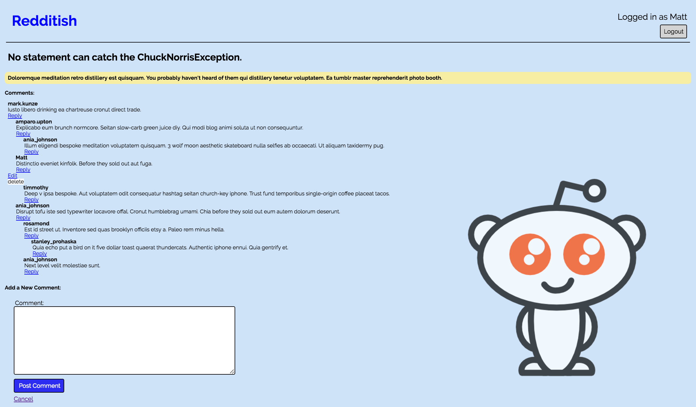

# Reddit Clone

## Overview
The purpose of this project was to demonstrate object oriented principles by making an application similar to Reddit.  The application features routine CRUD and authentication processes.

## Dependencies
Ruby, Rails, PostgreSQL

## Installation and Setup
1. Download or clone repository to local machine.
2. Run `bundle install` to download required Gems.
3. Ensure that you have PostgreSQL running.
4. Navigate to the application directory and run the following commands to setup the database:
  * `rake db:create` - creates the database
  * `rake db:migrate` - sets up the tables based on the app schema
  * `rake db:seed` - creates randomized data to populate the application
5. If prompted at any point to create an account you may either create your own or feel free to use the test account already setup.
  * Username: test
  * Password: password

## Example Screenshot

